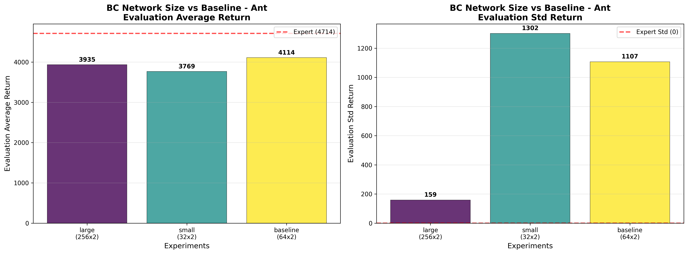
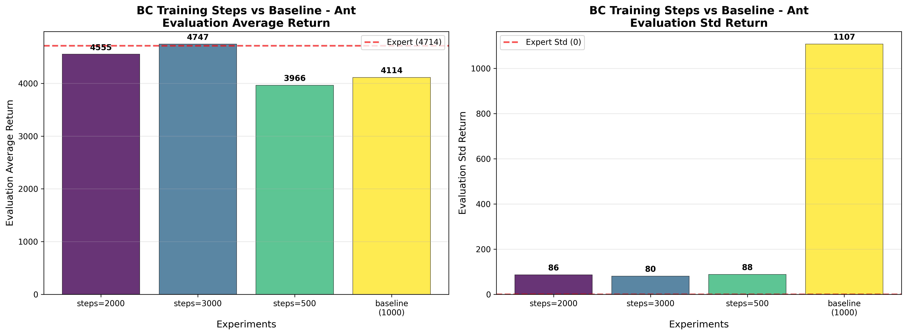
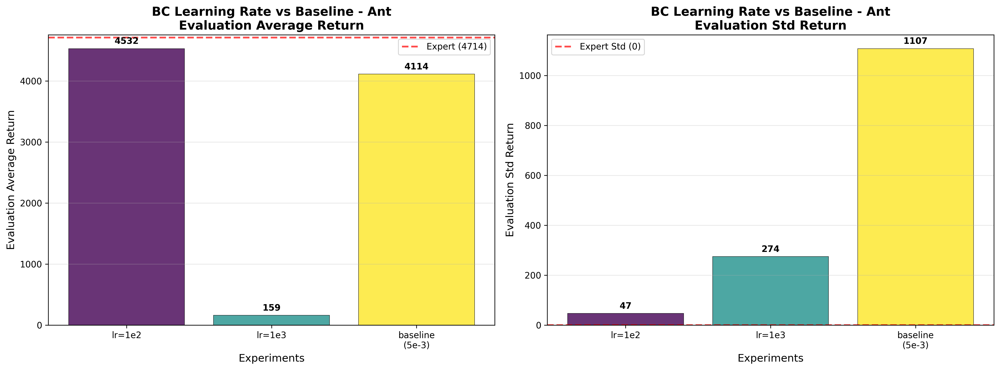
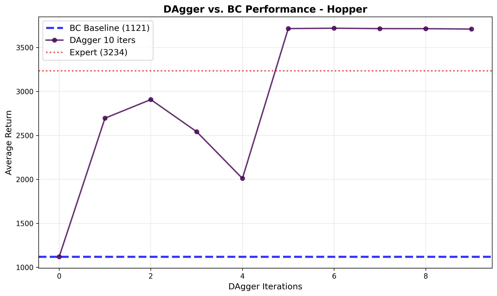
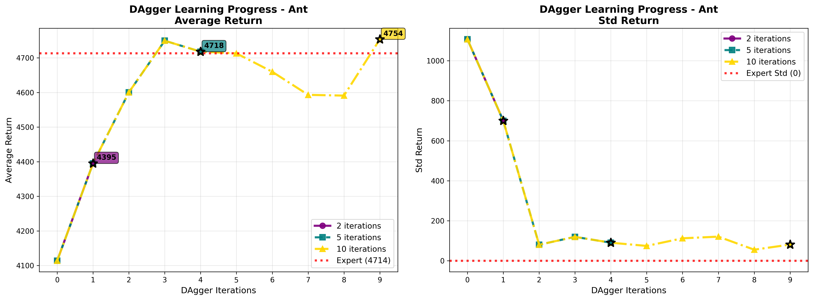

# 1.Behavioral Cloning

## 1.eval_averageretrun & eval_stdreturn

| env            | eval/train_average | eval/train_std |
| -------------- | ------------------ | -------------- |
| Ant-v4         | 4113/4681          | 1107/30        |
| Hopper-v4      | 1120/3717          | 337/0.35       |
| Walker2d-v4    | 1283/5383          | 1387/54        |
| HalfCheetah-v4 | 3866/4034          | 41/32          |

### 0.I found that loss function choose matter!

and no matter forward return an action or a distribution

the following experiments all use 'eval_batch_size=5000'

#### 1.MLP_policy.forward return an action , use MSE

Eval_AverageReturn : -477.34759521484375
Eval_StdReturn : 132.45663452148438

Train_AverageReturn : 4034.7999834965067
Train_StdReturn : 32.8677631311341

Training Loss : 0.004244372248649597

#### 2.MLP_policy.forward return a distribution , use MLE

Eval_AverageReturn : 4113.93359375
Eval_StdReturn : 1107.3634033203125

Train_AverageReturn : 4681.891673935816
Train_StdReturn : 30.70862278765526

Training Loss : -1592.7430419921875

#### 3.MLP_policy.forward return a distribution , use MSE

Eval_AverageReturn : -477.34759521484375
Eval_StdReturn : 132.45663452148438

Train_AverageReturn : 4034.7999834965067
Train_StdReturn : 32.8677631311341

Training Loss : 0.004244372248649597

#### 4.MLP_policy.forward return an action , use MLE

MLE(Maximum Likelihood Loss) need a distribution to calculate the probability

## 2.hyperparameters experiments

why lr=1e3 behave poorly? i run different seeds and find the num_agent_train_steps_per_iter matters . when use lr=1e3 steps=5000 different seeds always have good results.

so maybe the training step is fixed here and small lr can't find the best performance

# 2.DAGGER

