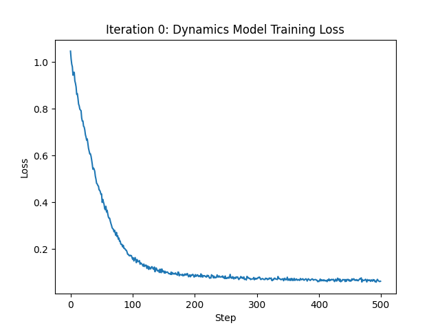
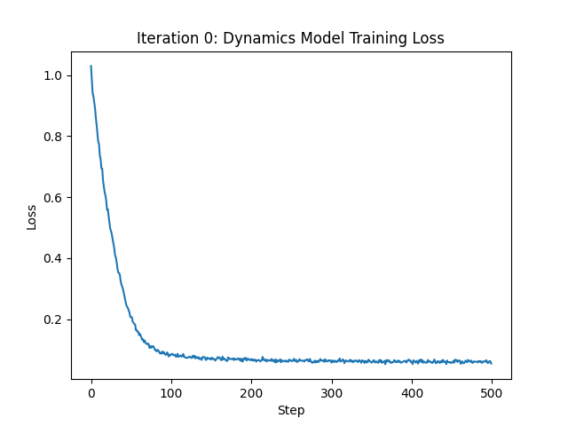
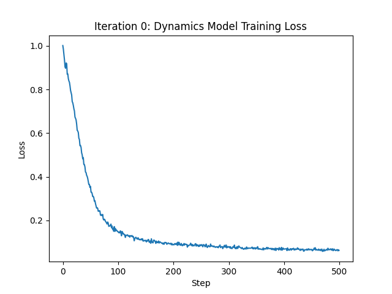
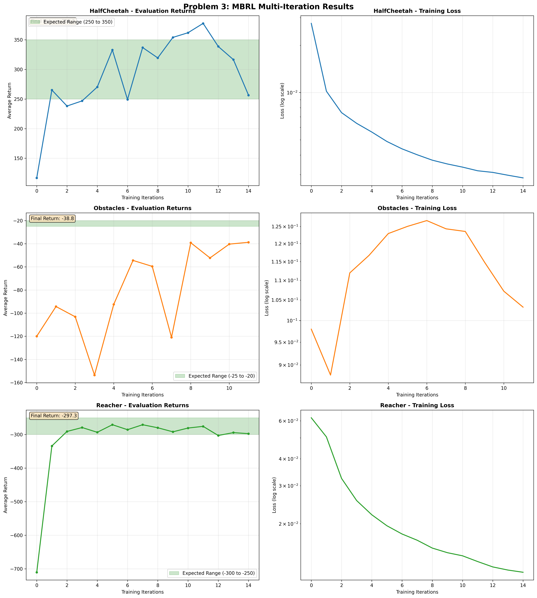
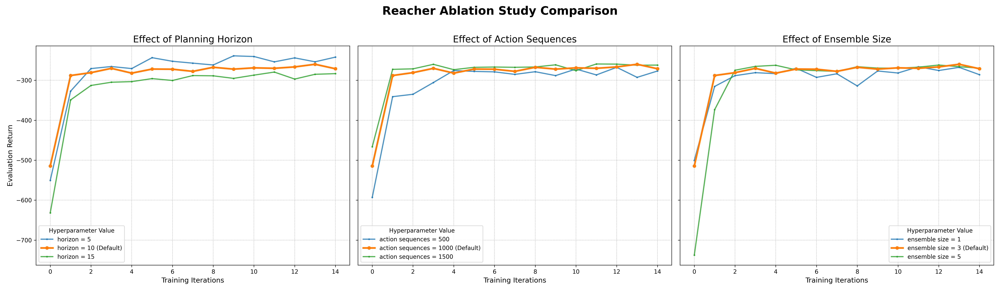
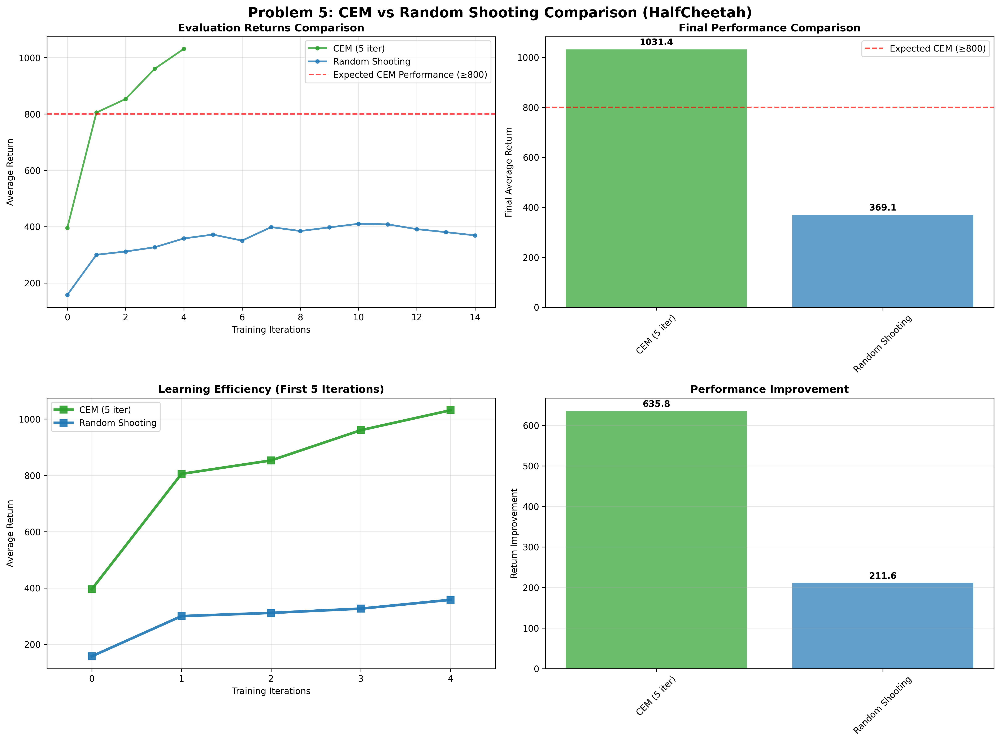
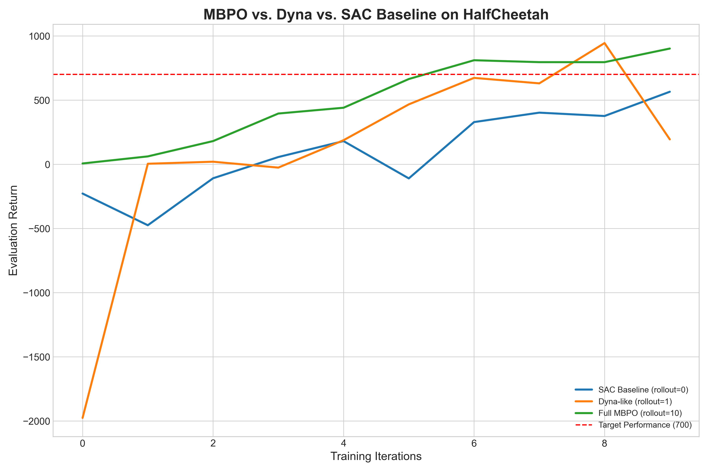

Problem 1

三个简单改变超参数实验

python cs285/scripts/run_hw4.py -cfg experiments/mpc/halfcheetah_0_iter.yaml

1.L1_H32

2.L1_H64

3.L2_H64

Problem 2

python cs285/scripts/run_hw4.py -cfg experiments/mpc/obstacles_1_iter.yaml

Average eval return: -32.022972106933594

Problem 3

python cs285/scripts/run_hw4.py -cfg experiments/mpc/reacher_multi_iter.yaml

python cs285/scripts/run_hw4.py -cfg experiments/mpc/reacher_multi_iter.yaml

python cs285/scripts/run_hw4.py -cfg experiments/mpc/halfcheetah_multi_iter.yaml

Problem 4

Problem 5

python cs285/scripts/run_hw4.py -cfg experiments/mpc/halfcheetah_cem.yaml

Problem 6

