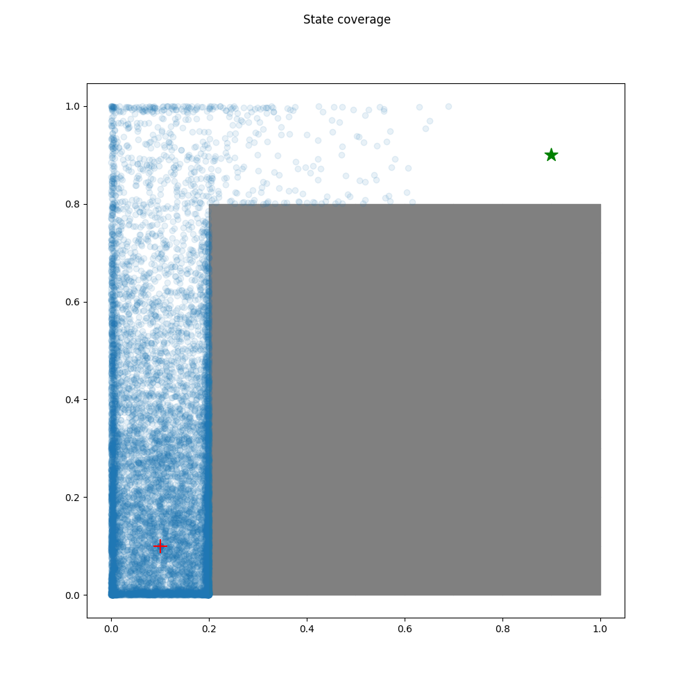
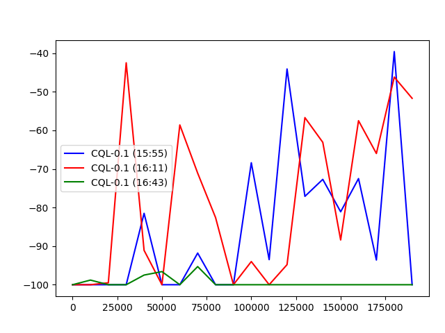

# 1.Exploration

### 1.1 Random Policy

### 1.2 RND

# 2.Offline RL

### 2.1 CQL

#### 2.1.1 与DQN在easy和medium环境中对比：

#### 2.1.2 CQL不同alpha参数性能对比

alpha=0

alpha=0.1

#### 2.1.3 IQL & AWAC

环境难，数据集质量低，收集数据少，训练步数少，效果差

###### IQL

step=10000

###### AWAC

step=30000

#### 2.1.4 Data ablations

Run RND with total_steps 1000, 5000, 10000, and 20000 on Hard environment

use CQL agent compare difference sizes of dataset

rnd 20k:

rnd 50k:

compare 10k 20k 50k:

blue: 20k 	 red: 50k	green: 10k

### 3.Online Fine-Tuning

#### 3.1 CQL dataset: rnd 20k

#### 3.2 AWAC dataset:50k

